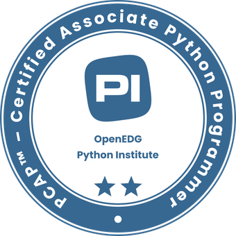

# 👋 Hi I'm John
An IT Speciliast aspiring to become a Full-Stack Developer  Studied Computer Science at University of Hawaii at Manoa Currently learning TypeScript and Redux Continously learning and improving

# 💻 Tech Stack:
   
 

      

# 🚀 Certifications:
       

# 📊 GitHub Stats:
 
 

<!-- Proudly created with GPRM ( https://gprm.itsvg.in ) -->
